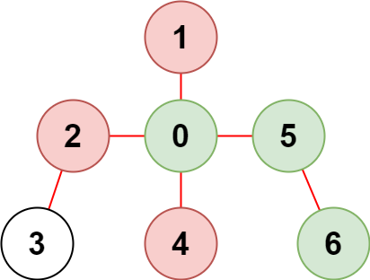

# #2368. Reachable Nodes With Restrictions

<p>There is an undirected tree with <code>n</code> nodes labeled from <code>0</code> to <code>n - 1</code> and <code>n - 1</code> edges.</p>

<p>You are given a 2D integer array <code>edges</code> of length <code>n - 1</code> where <code>edges[i] = [a<sub>i</sub>, b<sub>i</sub>]</code> indicates that there is an edge between nodes <code>a<sub>i</sub></code> and <code>b<sub>i</sub></code> in the tree. You are also given an integer array <code>restricted</code> which represents <strong>restricted</strong> nodes.</p>

<p>Return <em>the <strong>maximum</strong> number of nodes you can reach from node </em><code>0</code><em> without visiting a restricted node.</em></p>

<p>Note that node <code>0</code> will <strong>not</strong> be a restricted node.</p>

<p>&nbsp;</p>
<p><strong class="example">Example 1:</strong></p>

<pre><strong>Input:</strong> n = 7, edges = [[0,1],[1,2],[3,1],[4,0],[0,5],[5,6]], restricted = [4,5]
<strong>Output:</strong> 4
<strong>Explanation:</strong> The diagram above shows the tree.
We have that [0,1,2,3] are the only nodes that can be reached from node 0 without visiting a restricted node.
</pre>

<p><strong class="example">Example 2:</strong></p>

<pre><strong>Input:</strong> n = 7, edges = [[0,1],[0,2],[0,5],[0,4],[3,2],[6,5]], restricted = [4,2,1]
<strong>Output:</strong> 3
<strong>Explanation:</strong> The diagram above shows the tree.
We have that [0,5,6] are the only nodes that can be reached from node 0 without visiting a restricted node.
</pre>

<p>&nbsp;</p>
<p><strong>Constraints:</strong></p>

<ul>
	<li><code>2 &lt;= n &lt;= 10<sup>5</sup></code></li>
	<li><code>edges.length == n - 1</code></li>
	<li><code>edges[i].length == 2</code></li>
	<li><code>0 &lt;= a<sub>i</sub>, b<sub>i</sub> &lt; n</code></li>
	<li><code>a<sub>i</sub> != b<sub>i</sub></code></li>
	<li><code>edges</code> represents a valid tree.</li>
	<li><code>1 &lt;= restricted.length &lt; n</code></li>
	<li><code>1 &lt;= restricted[i] &lt; n</code></li>
	<li>All the values of <code>restricted</code> are <strong>unique</strong>.</li>
</ul>

## Notes

Simplest way to solve this would be by building graphs and adding restrictions as "seen". 
This can be optimized if we would build restrictions first and excluding restricted vertexes during graph build.
Note, that it is impossible to determine how much less than `n` memory would be required for graphs hash map without 
actually analyzing entire graph structure as restricted nodes do not necessarily include all graphs and they act more 
like an obstructions to reach leaves rather than blacklist of nodes. I.e, if we have graph: `0 <-> 1 <-> 2` and node `1` 
is blacklisted - that means node `2` is now orphan node, which would get included into graph hash map

```go
// Package reachablenodeswithrestrictions contains solution for LeetCode problem:
// #2368. Reachable Nodes With Restrictions.
package reachablenodeswithrestrictions

// reachableNodes returns the maximum number of nodes you can reach from node 0 without visiting a restricted node.
func reachableNodes(n int, edges [][]int, restricted []int) int {
	seen := make([]bool, n)
	for _, restriction := range restricted {
		seen[restriction] = true
	}

	graphs := make([][]int, n)
	for _, edge := range edges {
		v1, v2 := edge[0], edge[1]
		if seen[v1] || seen[v2] {
			continue
		}
		graphs[v1] = append(graphs[v1], v2)
		graphs[v2] = append(graphs[v2], v1)
	}

	var res int
	var dfs func(source int)
	dfs = func(source int) {
		if !seen[source] {
			seen[source] = true
			res++
			for _, target := range graphs[source] {
				dfs(target)
			}
		}
	}
	dfs(0)
	return res
}
```