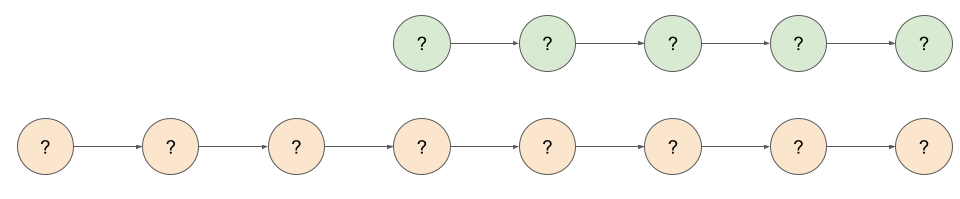
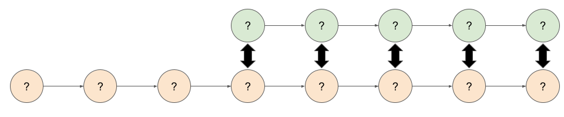
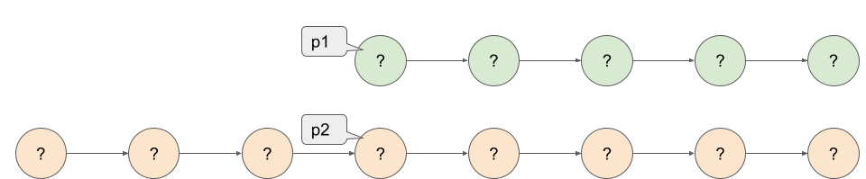
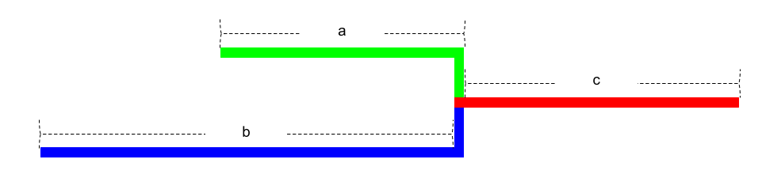

# #160. Intersection of Two Linked Lists

<p>Given the heads of two singly linked-lists <code>headA</code> and <code>headB</code>, return <em>the node at which the two lists intersect</em>. If the two linked lists have no intersection at all, return <code>null</code>.</p>

<p>For example, the following two linked lists begin to intersect at node <code>c1</code>:</p>

<p>The test cases are generated such that there are no cycles anywhere in the entire linked structure.</p>

<p><strong>Note</strong> that the linked lists must <strong>retain their original structure</strong> after the function returns.</p>

<p><strong>Custom Judge:</strong></p>

<p>The inputs to the <strong>judge</strong> are given as follows (your program is <strong>not</strong> given these inputs):</p>

<ul>
	<li><code>intersectVal</code> - The value of the node where the intersection occurs. This is <code>0</code> if there is no intersected node.</li>
	<li><code>listA</code> - The first linked list.</li>
	<li><code>listB</code> - The second linked list.</li>
	<li><code>skipA</code> - The number of nodes to skip ahead in <code>listA</code> (starting from the head) to get to the intersected node.</li>
	<li><code>skipB</code> - The number of nodes to skip ahead in <code>listB</code> (starting from the head) to get to the intersected node.</li>
</ul>

<p>The judge will then create the linked structure based on these inputs and pass the two heads, <code>headA</code> and <code>headB</code> to your program. If you correctly return the intersected node, then your solution will be <strong>accepted</strong>.</p>

<p>&nbsp;</p>
<p><strong class="example">Example 1:</strong></p>

<pre><strong>Input:</strong> intersectVal = 8, listA = [4,1,8,4,5], listB = [5,6,1,8,4,5], skipA = 2, skipB = 3
<strong>Output:</strong> Intersected at '8'
<strong>Explanation:</strong> The intersected node's value is 8 (note that this must not be 0 if the two lists intersect).
From the head of A, it reads as [4,1,8,4,5]. From the head of B, it reads as [5,6,1,8,4,5]. There are 2 nodes before the intersected node in A; There are 3 nodes before the intersected node in B.
- Note that the intersected node's value is not 1 because the nodes with value 1 in A and B (2<sup>nd</sup> node in A and 3<sup>rd</sup> node in B) are different node references. In other words, they point to two different locations in memory, while the nodes with value 8 in A and B (3<sup>rd</sup> node in A and 4<sup>th</sup> node in B) point to the same location in memory.
</pre>

<p><strong class="example">Example 2:</strong></p>

<pre><strong>Input:</strong> intersectVal = 2, listA = [1,9,1,2,4], listB = [3,2,4], skipA = 3, skipB = 1
<strong>Output:</strong> Intersected at '2'
<strong>Explanation:</strong> The intersected node's value is 2 (note that this must not be 0 if the two lists intersect).
From the head of A, it reads as [1,9,1,2,4]. From the head of B, it reads as [3,2,4]. There are 3 nodes before the intersected node in A; There are 1 node before the intersected node in B.
</pre>

<p><strong class="example">Example 3:</strong></p>

<pre><strong>Input:</strong> intersectVal = 0, listA = [2,6,4], listB = [1,5], skipA = 3, skipB = 2
<strong>Output:</strong> No intersection
<strong>Explanation:</strong> From the head of A, it reads as [2,6,4]. From the head of B, it reads as [1,5]. Since the two lists do not intersect, intersectVal must be 0, while skipA and skipB can be arbitrary values.
Explanation: The two lists do not intersect, so return null.
</pre>

<p>&nbsp;</p>
<p><strong>Constraints:</strong></p>

<ul>
	<li>The number of nodes of <code>listA</code> is in the <code>m</code>.</li>
	<li>The number of nodes of <code>listB</code> is in the <code>n</code>.</li>
	<li><code>1 &lt;= m, n &lt;= 3 * 10<sup>4</sup></code></li>
	<li><code>1 &lt;= Node.val &lt;= 10<sup>5</sup></code></li>
	<li><code>0 &lt;= skipA &lt;&nbsp;m</code></li>
	<li><code>0 &lt;= skipB &lt;&nbsp;n</code></li>
	<li><code>intersectVal</code> is <code>0</code> if <code>listA</code> and <code>listB</code> do not intersect.</li>
	<li><code>intersectVal == listA[skipA] == listB[skipB]</code> if <code>listA</code> and <code>listB</code> intersect.</li>
</ul>

<p>&nbsp;</p>
<strong>Follow up:</strong> Could you write a solution that runs in <code>O(m + n)</code> time and use only <code>O(1)</code> memory?

## Notes

This problem can be solved with Two Pointers, thus giving `O(1)` space complexity.

We know that we've now fully optimized the time complexity: it's impossible to do better than `O(N+M)` as, in the worst case, we'll need to look at every node at least once. But, is there a way we can get the space complexity down to `O(1)` while maintaining that awesome `O(N+M)` time complexity that we just achieved? It turns out that there is!

Observe that while list A and list B could be different lengths, that the shared "tail" following the intersection has to be the same length.

Imagine that we have two linked lists, A and B, and we know that their lengths are N and M respectively (these can be calculated with `O(1)` space and in time proportional to the length of the list). We'll imagine that N=5 and M=8.



Because the "tails" must be the same length, we can conclude that if there is an intersection, then the intersection node will be one of these 5 possibilities.



So, to check for each of these pairs, we would start by setting a pointer at the start of the shorter list, and a pointer at the first possible matching node of the longer list. The position of this node is simply the difference between the two lengths, that is, `∣M−N∣`.



Then, we just need to step the two pointers through the list, each time checking whether or not the nodes are the same.

In code, we could write this algorithm with 4 loops, one after the other, each doing the following:

<ol>
    <li>Calculate N; the length of list A.</li>
    <li>Calculate M; the length of list B.</li>
    <li>Set the start pointer for the longer list.</li>
    <li>Step the pointers through the list together.</li>
</ol>

While this would have a time complexity of `O(N+M)` and a space complexity of `O(1)` and would be fine for an interview, we can still simplify the code a bit! As some quick reassurance, most people will struggle to come up with this next part by themselves. It takes practice and seeing lots of linked list and other math problems.

If we say that `c` is the shared part, `a` is exclusive part of `list A` and `b` is exclusive part of `list B`, then we can have one pointer that goes over `a + c + b` and the other that goes over `b + c + a`. Have a look at the diagram below, and this should be fairly intuitive.



This is the above algorithm in disguise - one pointer is essentially measuring the length of the longer list, and the other is measuring the length of the shorter list, and then placing the start pointer for the longer list. Then both are stepping through the list together. By seeing the solution in this way though, we can now implement it as a single loop.

Code:

```java
/**
 * Solution class contains solution for LeetCode problem:
 * #160. Intersection of Two Linked Lists.
 *
 * @author Marius Gaigalas on 01/08/2024
 */
public class Solution {
    /**
     * Given the heads of two singly linked-lists headA and headB, returns the node at which the two lists intersect.
     * If the two linked lists have no intersection at all, returns null.
     *
     * @param headA linked-list
     * @param headB linked-list
     * @return node at which the two lists intersect
     */
    public ListNode getIntersectionNode(ListNode headA, ListNode headB) {
        var nodeA = headA;
        var nodeB = headB;
        while (nodeA != nodeB) {
            nodeA = nodeA == null ? headB : nodeA.next;
            nodeB = nodeB == null ? headA : nodeB.next;
        }
        return nodeA;
    }
}
```